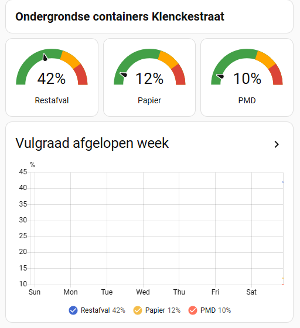

# Home Assistant Integration

Monitor your nearby underground container fill levels directly in Home Assistant using REST sensors.



## How it works

The GitHub Pages site publishes `data/state.json` containing current fill rates for all 600+ containers. Home Assistant fetches this JSON hourly and exposes individual container values as sensors.

## Setup

### 1. Add REST sensor configuration

Create `rest/afvalcontainers.yaml` (or add to your existing `rest.yaml`):

```yaml
resource: https://graafg.github.io/assen-afvalmonitor/data/state.json
scan_interval: 3600
sensor:
  - name: Klenckestraat Restafval vulgraad
    value_template: "{{ value_json['148'] }}"
    unit_of_measurement: "%"
    icon: mdi:trash-can
    unique_id: afval-klenckestraat-restafval
  - name: Klenckestraat Papier vulgraad
    value_template: "{{ value_json['148PAP'] }}"
    unit_of_measurement: "%"
    icon: mdi:newspaper-variant-outline
    unique_id: afval-klenckestraat-papier
  - name: Klenckestraat PMD vulgraad
    value_template: "{{ value_json['748PMD'] }}"
    unit_of_measurement: "%"
    icon: mdi:bottle-soda-classic-outline
    unique_id: afval-klenckestraat-pmd
```

### 2. Include in configuration.yaml

If using a directory structure:

```yaml
rest: !include_dir_list rest
```

Or if using a single file:

```yaml
rest: !include rest.yaml
```

### 3. Find your container IDs

Look up your containers in [`data/containers_fillrates.json`](../data/containers_fillrates.json). Each container has a `nr` field (e.g. `148`, `148PAP`, `748PMD`) that corresponds to the keys in `state.json`.

Container number suffixes indicate the waste type:
- No suffix → Restafval
- `PAP` → Papier en karton
- `PMD` → Plastic, metaal, drinkpakken
- `BIO` → GFT/Bioafval (sensors often read 0%)

### 4. Dashboard card (optional)

Add a gauge card to your Lovelace dashboard:

```yaml
type: horizontal-stack
cards:
  - type: gauge
    entity: sensor.klenckestraat_restafval_vulgraad
    name: Restafval
    unit: "%"
    min: 0
    max: 100
    severity:
      green: 0
      yellow: 60
      red: 80
    needle: true
  - type: gauge
    entity: sensor.klenckestraat_papier_vulgraad
    name: Papier
    unit: "%"
    min: 0
    max: 100
    severity:
      green: 0
      yellow: 60
      red: 80
    needle: true
  - type: gauge
    entity: sensor.klenckestraat_pmd_vulgraad
    name: PMD
    unit: "%"
    min: 0
    max: 100
    severity:
      green: 0
      yellow: 60
      red: 80
    needle: true
```

## Notes

- Data updates once daily at 05:00 via GitHub Actions
- `scan_interval: 3600` (1 hour) ensures HA picks up new data promptly and retries on transient errors
- BIO containers typically show 0% because their sensors are inactive
- The history graph works best after a few days of data collection
